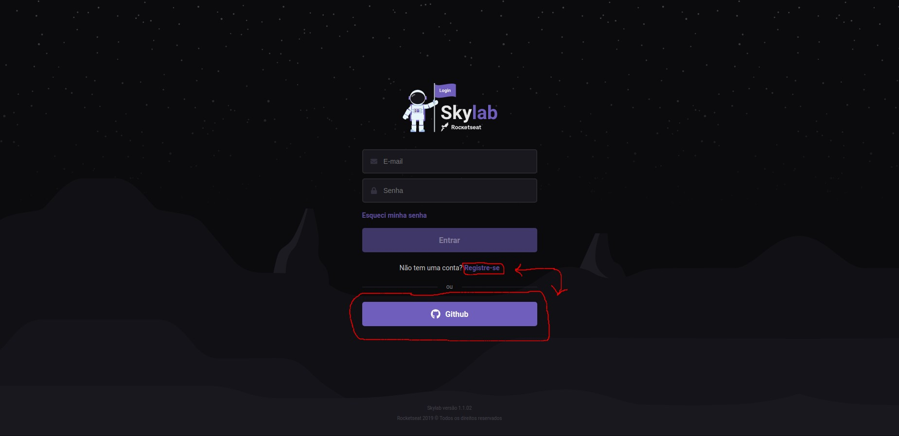
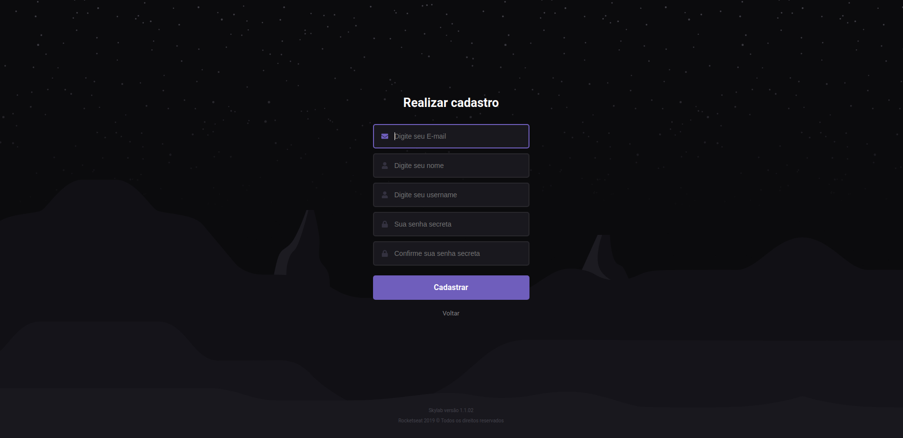

# curso-js-iniciante

## Curso produzido pela RocketSeat!

Resolução das questões produzida por este que vos escreve. :wink:

Para os interessados em fazer o curso segue o link para o site: https://skylab.rocketseat.com.br/

Para executar o cadastro existem daus opções incluindo usar uma conta github.

Caso escolha se registrar no próprio site, basta preenhcer com suas informações.

## [Módulo 1](https://github.com/brunodhein/curso-js-iniciante/tree/master/Modulo-1)

### Acesso aos exercícios:

- [Exercício 1](https://github.com/brunodhein/curso-js-iniciante/tree/master/Modulo-1/Exerc%C3%ADcio%201)
- [Exercício 2](https://github.com/brunodhein/curso-js-iniciante/tree/master/Modulo-1/Exerc%C3%ADcio%202)
- [Exercício 3](https://github.com/brunodhein/curso-js-iniciante/tree/master/Modulo-1/Exerc%C3%ADcio%203)
- [Exercício 4](https://github.com/brunodhein/curso-js-iniciante/tree/master/Modulo-1/Exerc%C3%ADcio%204)
- [Exercício 5](https://github.com/brunodhein/curso-js-iniciante/tree/master/Modulo-1/Exerc%C3%ADcio%205)

## [Módulo 2](https://github.com/brunodhein/curso-js-iniciante/tree/master/Modulo-2)

### Acesso aos exercícios:

- [Exercício 1](https://github.com/brunodhein/curso-js-iniciante/tree/master/Modulo-2/Exerc%C3%ADcio%201)
- [Exercício 2](https://github.com/brunodhein/curso-js-iniciante/tree/master/Modulo-2/Exerc%C3%ADcio%202)
- [Exercício 3](#)
- [Exercício 4](#)
- [Exercício 5](#)
